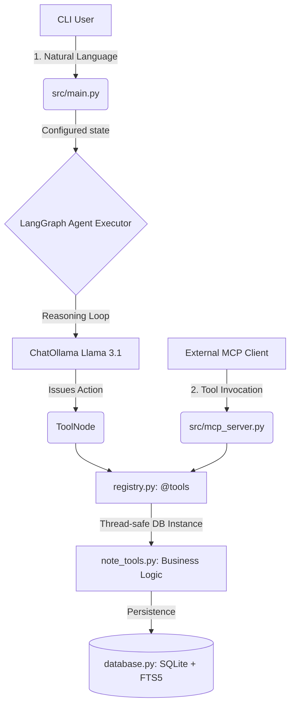

# Code Walkthrough — TechLabs Conversational Agent

This document provides a guided tour of the codebase, ideal for reviewers or contributors seeking to understand the architectural design patterns applied in this AI agent.

## 🧭 System Architecture Map

## 🏗️ Core Modules Explained

### 1. `src/agent/agent.py` — The Brain 🧠
This file is the control centre. 
- It stitches together the LLM (`langchain_ollama`) with our tools into a deterministic `StateGraph`. 
- **Design Pattern**: Using `tools_condition` ensures the graph automatically halts to ask the LLM if it wants to invoke a tool (`registry.py`), looping until the LLM writes a final `AIMessage` to the user.
- **State Checkpointing**: Leveraged `MemorySaver` to checkpoint LangGraph runs. Every `thread_id` keeps its own immutable state history, granting the agent seamless multi-turn conversation abilities. 

### 2. `src/agent/system_prompt.py` — The Guardrails 🛡️
Kept carefully isolated from the hard logic. This dictates how the Llama 3.1 model interprets instructions.
- We deliberately structured strict "first-principle rules", notably enforcing sequential Tool execution.
- *E.g. It commands the model to NEVER execute `update` or `delete` before executing `list_notes`, enforcing ID validation dynamically.*

### 3. `src/storage/database.py` — The Memory 🗄️
A highly optimized SQLite abstraction layer.
- **Why SQLite over JSON?** Support for concurrent execution via threads and heavy full-text lookups.
- **FTS5 Integration**: By implementing `sqlite3` triggers (e.g., `notes_fts_insert`), the database self-manages a background shadow table. This enables blazing-fast query execution `MATCH ?` when the user instructs the LLM to search notes, without us writing complex inverse indexing in Python.
- **Multi-tenant Safe**: Explicit `user_id` injection on all queries. Evaluated as a mandatory perimeter to prevent accidental cross-user data leakage.

### 4. `src/tools/registry.py` & `note_tools.py` — The Limbs 🦾
This splits the "concept" of a tool from its "AI Wrapper".
- `note_tools.py` contains **pure python deterministic business logic**. It knows nothing about AI, Pydantic, or LangChain.
- `registry.py` bridges the pure logic to LangChain.
- **Thread Safety Resolution**: Because LangGraph executes `ToolNode` asynchronously across OS threads, we don't pass live `sqlite3.Connection` objects. Instead, the `RunnableConfig` passes the database path, and tools execute `_get_db_and_user()`, safely opening/closing connections per thread context.

### 5. `src/tools/schemas.py` — The Strict Types 📐
Leverages `Pydantic BaseModel`. This generates the JSON Schema payload required by Llama 3.1's native functions. Strongly typing these parameters prevents the LLM from passing unpredictable structures down into our SQLite queries.

### 6. `tests/eval/harness.py` — The Inspector 🕵️
A programmatic testing engine built to satisfy assessment requirements.
- It bypasses CLI interaction, feeding static script arrays directly to the Agent.
- It parses the internal LLM graph states via `ToolMessage` evaluation to detect if the agent correctly executed expected sub-routines (like confirming deletions before dropping data). 

---

## 🔌 Advanced Bonus Implementations

### MCP Support (`src/mcp_server.py`)
Model Context Protocol allows universal interoperability. By isolating `note_tools` from LangGraph, we easily wrapped our backend logic inside Anthropic's `FastMCP`. The underlying CRUD functions can now be invoked via STDIO by standard desktop agents (e.g. Claude Desktop) entirely independent of the `src.main` CLI. 

### Self-Healing Error Loops
Inside `note_tools.py`, if an operation fails (e.g., the LLM hallucinates an invalid UUID), the function yields an explicit error string:
> `"Error: Note <id> not found. You MUST call list_notes_tool to verify valid note IDs before replying."`

When this is fed back into the LangGraph loop, it triggers a **self-healing response**. The LLM immediately corrects itself by executing the List tool autonomously, resolving the user's intent without failing the prompt constraint.
